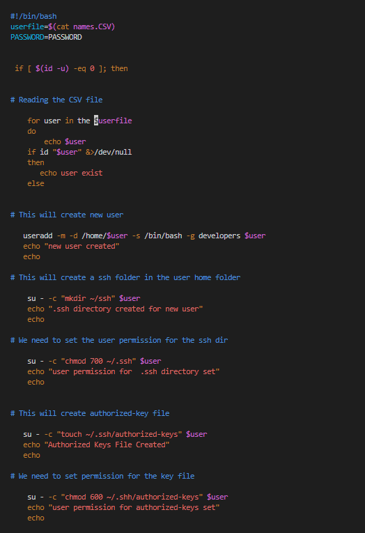
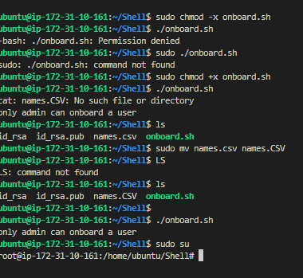
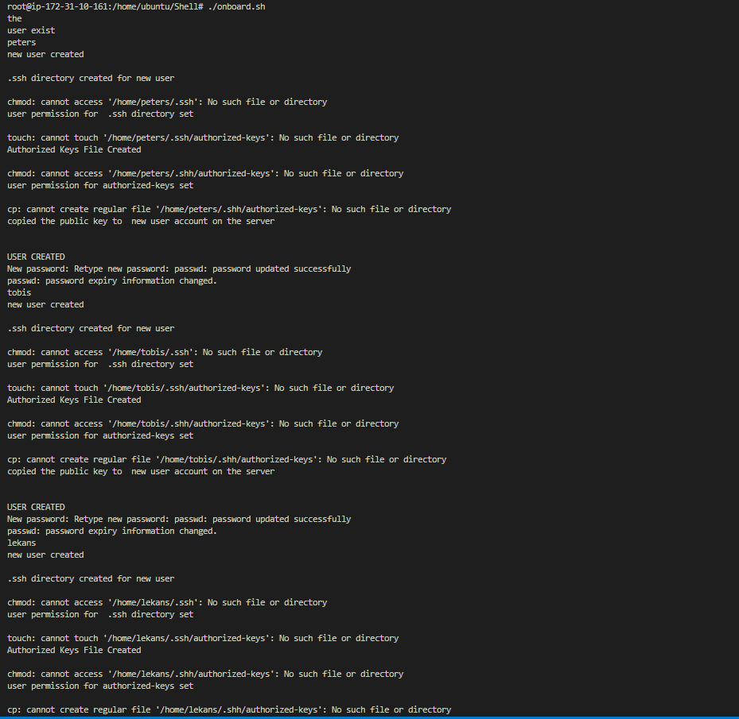
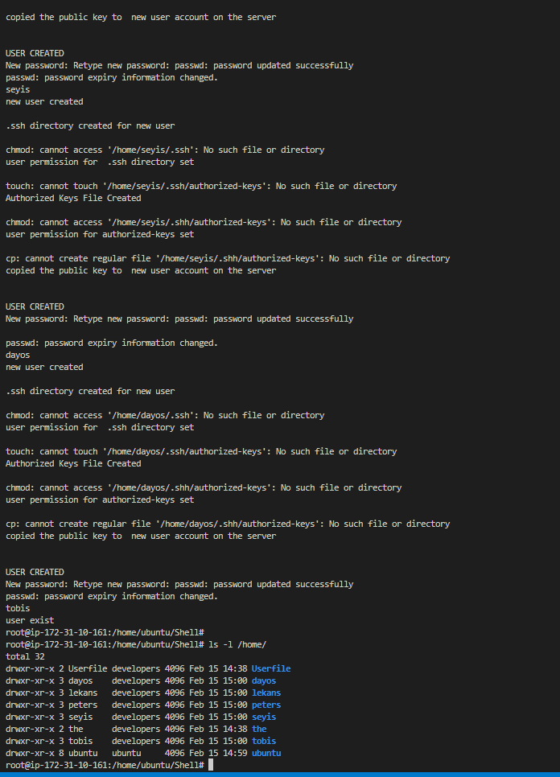

# **SHELL SCRIPTING**

**followed the following steps below**

**next step was to write a script to give the following instructions**

**then i followed the steps below**

**finally i tested my script to see if it works well**

      

          the image above was when i tested my script as a normal user not as a root user
 
 
 

**the image below was when i tested my script as a  root user**

