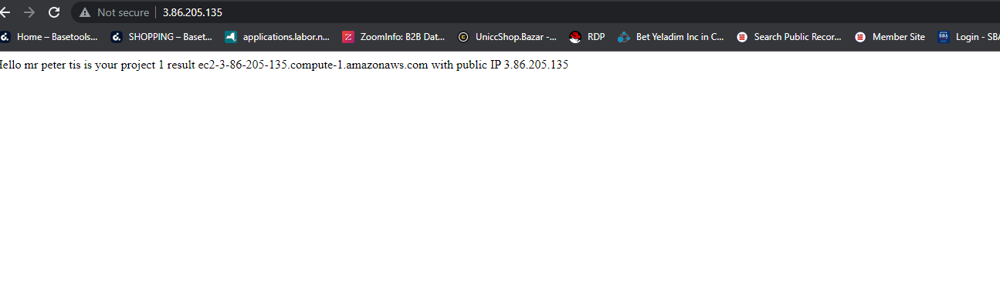
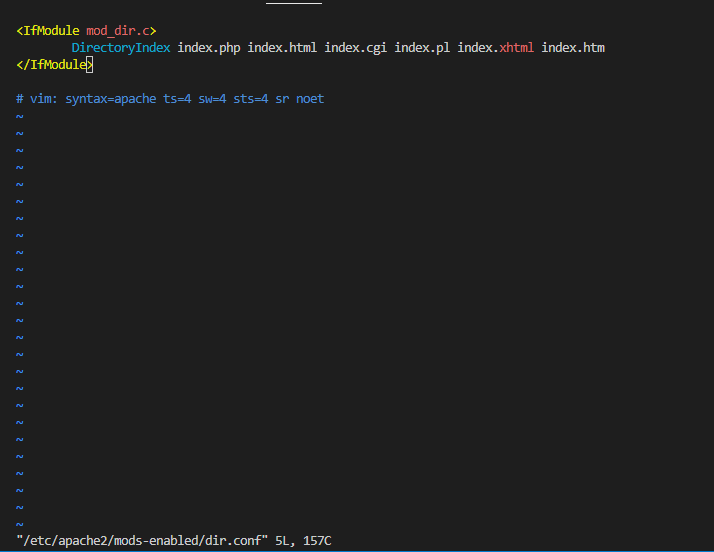
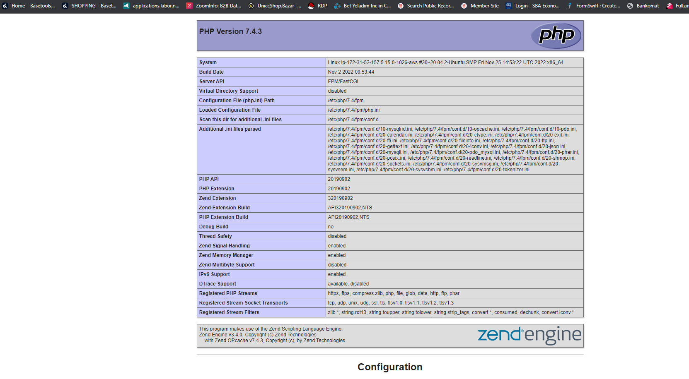

# WEB STACK IMPLEMENTATION (LAMP STACK) IN AWS

## **so to implement our lamp stack we have to firstly**

* Install apache and update firewall

Install Apache using Ubuntu’s package manager ‘apt’:

             #update a list of packages in package manager using the command below   
             
 `sudo apt update`

 

   
             #run apache2 package installation using the command below
`sudo apt install apache2`

* verify if our apache2 is running on our OS with the command below 

`sudo systemctl status apache2`

## the next thing to do is go to your aws ............
## add a rule to EC2 configuration to open inbound connection through port 80: by
* click on your instance to show your details
* go to network and find security groups
* click on impound rules 
* click on edit impound rules
* click on add rules        

        # TYPE: custom tcp     PROTOCOL: tcp    PORT RANGE: 80  SOURCE: custom 
        
        configure your impound rules like this 

* save rules 

## then try to check if we can access it locally  our ubuntu why using the command below
`curl http://localhost:80`

## test how our Apache HTTP server can respond to requests from the Internet.
Open a web browser of your choice and try to access following url
inputting your ip address where public-ip-address is written

 `http://<Public-IP-Address>:80`

## **NEXT STEP IS TO INSTALL MYSQL**
Again, use ‘apt’ to acquire and install this software:

`sudo apt install mysql-server`

When prompted, confirm installation by typing Y, and then ENTER.

When the installation is finished, log in to the MySQL console by typing:

`sudo mysql`

It’s recommended that you run a security script that comes pre-installed with MySQL. This script will remove some insecure default settings and lock down access to your database system. Before running the script you will set a password for the root user, using mysql_native_password as default authentication method. We’re defining this user’s password as Oladiph99%

`ALTER USER 'root'@'localhost' IDENTIFIED WITH mysql_native_password BY 'Oladiph99%';`

    mysql> ALTER USER 'root'@'localhost' IDENTIFIED WITH mysql_native_password BY 'Oladiph99%';
     Query OK, 0 rows affected (0.01 sec)

Exit the MySQL shell with:

`mysql> exit`

Start the interactive script by running

 `sudo mysql_secure_installation`

 This will ask if you want to configure the VALIDATE PASSWORD PLUGIN
                
                VALIDATE PASSWORD PLUGIN can be used to test passwords
                and improve security. It checks the strength of password
                and allows the users to set only those passwords which are
                secure enough. Would you like to setup VALIDATE PASSWORD plugin?

                Press y|Y for Yes, any other key for No:

If you answer “yes”, you’ll be asked to select a level of password validation

               there are three levels of password validation policy:

               LOW    Length >= 8
               MEDIUM Length >= 8, numeric, mixed case, and special characters
               STRONG Length >= 8, numeric, mixed case, special characters and 
               dictionary              file

               Please enter 0 = LOW, 1 = MEDIUM and 2 = STRONG: 1

If you are happy with your current password, enter Y for “yes” at the prompt:

      Estimated strength of the password: 100 
      Do you wish to continue with the password provided?(Press y|Y for Yes, any 
      other key for No) : y

When you’re finished, test if you’re able to log in to the MySQL console by typing:

`sudo mysql -p`

## **NEXT IS INSTALLING OUR PHP**

*You have Apache installed to serve your content and MySQL installed to store and manage your data. **PHP** is the component of our setup that will process code to display dynamic content to the end user. In addition to the **php package**, you’ll need **php-mysql**, a PHP module that allows PHP to communicate with MySQL-based databases. You’ll also need **libapache2-mod-php** to enable Apache to handle PHP files. Core PHP packages will automatically be installed as dependencies.*

* To install these 3 packages at once, run:

`sudo apt install php libapache2-mod-php php-mysql`

* Once the installation is finished, you can run the following command to confirm your PHP version:

`php -v`

### At this point, your LAMP stack is completely installed and fully operational.

## STEP 4 — CREATING A VIRTUAL HOST FOR YOUR WEBSITE USING APACHE

In this project, you will set up a domain called projectlamp

Apache on Ubuntu 20.04 has one server block enabled by default that is configured to serve documents from the   **/var/www/html directory.**
We will leave this configuration as is and will add our own directory  next to the default one.

Create the directory for **projectlamp** using **‘mkdir’** command as follows

`sudo mkdir /var/www/projectlamp`

Next, assign ownership of the directory with your current system user:

 `sudo chown -R $USER:$USER /var/www/projectlamp`

### Then, i create and open a new configuration file in Apache’s sites-available directory using the  vi or vim  command 

`sudo vi /etc/apache2/sites-available/projectlamp.conf`

### li inserted the  bare-bones configuration below  in the blank sheet created

    <VirtualHost *:80>
    ServerName projectlamp
    ServerAlias www.projectlamp 
    ServerAdmin webmaster@localhost
    DocumentRoot /var/www/projectlamp
    ErrorLog ${APACHE_LOG_DIR}/error.log
    CustomLog ${APACHE_LOG_DIR}/access.log combined
    </VirtualHost>

###   You can use the ls command below  to show the new file in the sites-available director

`sudo ls /etc/apache2/sites-available`

## i followed the steps in the image below 

### **my  new website is now active, but the web root /var/www/projectlamp is still empty. i Creatd an index.html file in that location so that we can test that the virtual host works as expected**

`sudo echo 'Hello mr peter tis is your project 1 result' $(curl -s http://169.254.169.254/latest/meta-data/public-hostname) 'with public IP' $(curl -s http://169.254.169.254/latest/meta-data/public-ipv4) > /var/www/projectlamp/index.html`

## i opened my browser and try to open my  website URL using IP address

## TO ENABLE PHP ON THE WEBSITE

With the default DirectoryIndex settings on Apache, a file named **index.html** will always take precedence over an **index.php** file. This is useful for setting up maintenance pages in PHP applications, by creating a temporary **index.html** file containing an informative message to visitors. Because this page will take precedence over the **index.php** page, it will then become the landing page for the application. Once maintenance is over, the index.html is renamed or removed from the document root, bringing back the regular application page

### In case you want to change this behavior, you’ll need to edit the **/etc/apache2/mods-enabled/dir.conf**  file and change the order in which the **index.php** file is listed within the DirectoryIndex directive

`sudo vim /etc/apache2/mods-enabled/dir.conf`

### after making the changes my /etc/apache2/mods-enabled/dir.conf file looks like this 

## **Finally, I  created a PHP script to test that PHP is correctly installed and configured on your server using the command below**

`vim /var/www/projectlamp/index.php`

>## I RELOADED MY PAGE BY ADDING INDEX.PHP TO MY IP ADDRESS

## i romoved my index.php file  with the code below when im done with my LEMP installion

`sudo rm /var/www/projectlamp/index.php`