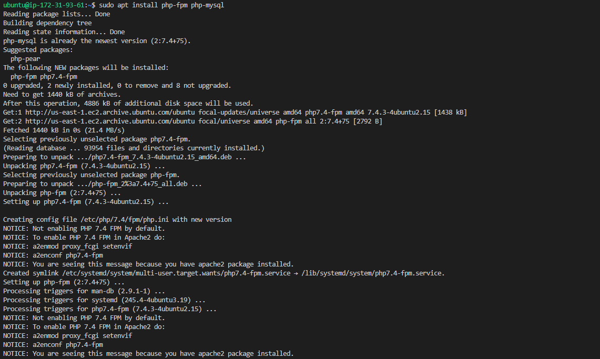

# **LEMP STACK IMPLEMENTATION**

##  first step is INSTALLING THE NGINX WEB SERVER
1.  start off by updating your server’s package index with the code below

   `sudo apt update`

2. installing nginx using the command below 

`sudo apt install nginx` 

3. verified if nginx was installed and running with the code below

`sudo systemctl status nginx`

## **NEXT STEP IS TO INSTALL MYSQL**
Again, use ‘apt’ to acquire and install this software:

`sudo apt install mysql-server`

When prompted, confirm installation by typing Y, and then ENTER.

When the installation is finished, log in to the MySQL console by typing:

`sudo mysql`

It’s recommended that you run a security script that comes pre-installed with MySQL. This script will remove some insecure default settings and lock down access to your database system. Before running the script you will set a password for the root user, using mysql_native_password as default authentication method. We’re defining this user’s password as Oladiph99%

`ALTER USER 'root'@'localhost' IDENTIFIED WITH mysql_native_password BY 'Oladiph99%';`

    mysql> ALTER USER 'root'@'localhost' IDENTIFIED WITH mysql_native_password BY 'Oladiph99%';
     Query OK, 0 rows affected (0.01 sec)

Exit the MySQL shell with:

`mysql> exit`

Start the interactive script by running

 `sudo mysql_secure_installation`

 This will ask if you want to configure the VALIDATE PASSWORD PLUGIN
                
                VALIDATE PASSWORD PLUGIN can be used to test passwords
                and improve security. It checks the strength of password
                and allows the users to set only those passwords which are
                secure enough. Would you like to setup VALIDATE PASSWORD plugin?

                Press y|Y for Yes, any other key for No:

If you answer “yes”, you’ll be asked to select a level of password validation

               there are three levels of password validation policy:

               LOW    Length >= 8
               MEDIUM Length >= 8, numeric, mixed case, and special characters
               STRONG Length >= 8, numeric, mixed case, special characters and 
               dictionary              file

               Please enter 0 = LOW, 1 = MEDIUM and 2 = STRONG: 1

If you are happy with your current password, enter Y for “yes” at the prompt:

      Estimated strength of the password: 100 
      Do you wish to continue with the password provided?(Press y|Y for Yes, any 
      other key for No) : y

When you’re finished, test if you’re able to log in to the MySQL console by typing:

`sudo mysql -p`

## next i installed php using the command below

`sudo apt install php-fpm php-mysql`

## NEXT IS CONFIGURING NGINX TO USE PHP PROCESSOR

^