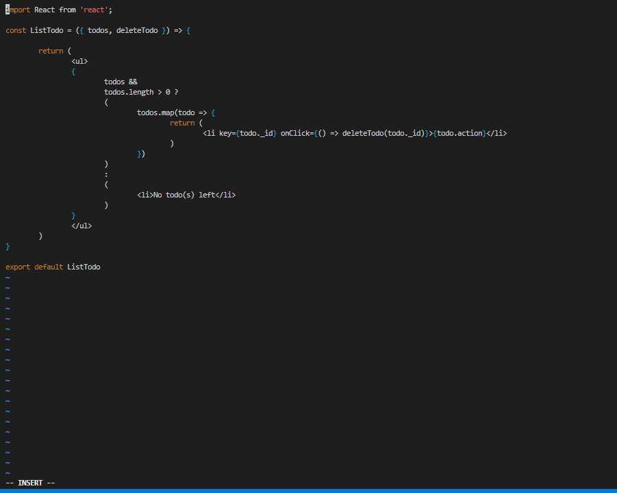
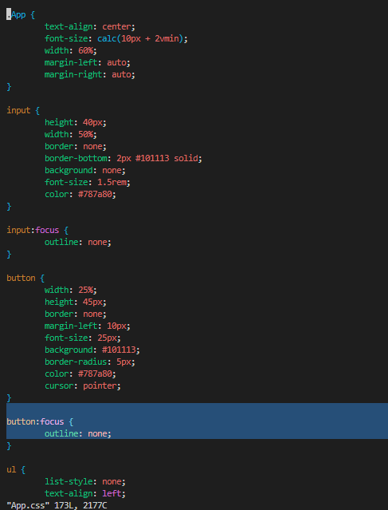

# **MERN STACK IMPLEMENTATION**

* ##  **BACKEND CONFIGURATION**
          so i updated my ubuntu with the code below

`sudo apt update`

       and i upgraded my ubuntu with the code below
`sudo apt upgrade`

      i got the location of my Node.js software from Ubuntu repositories with the code below

`curl -fsSL https://deb.nodesource.com/setup_18.x | sudo -E bash -`

      installed node.js with the code below

`sudo apt-get install -y nodejs`

       verified the nodejs installation  with "node -v" & "npm -v"

      

       I created a Todo directory and run `npm init`

      

* ##  **INSTALLING EXPRESSJS**
        I `npm install express` `touch index.js` and npm `install dotenv` in the Todo directory

       `vim index.js` pasting the necessary code 

       After that i `node index.js`, verified on the web broswer if its working fine, created a routes directory and `touch api.js` in the routes directory
    

       i pasted the provided code in the api.js 

* ## **CREATING MODELS**

         i  installed mongoose with `npm install mongoose`, created a models directory and `touch todo.js` in  models directory

          i pasted the provided code in the todo.js file

        i updated my api.js file in the routes directory

* ## **CREATED A MONGODB DATABASE**

           craeted a .env file in the Todo directory and i paste my mongodb strings in it

         I updated my index.js file with the code provided
        

          then i started my server using `node index.js` to connect to our mogodb database

         so i tested our API with postman

* ## **FRONTEND CREATION**

          i started my frontend creation by installing the react-app with the code below

` npx create-react-app client`

 

           installed concurrently with the code below

`npm install concurrently --save-dev`

        installed nodemon with the code below

`npm install nodemon --save-dev`

 
          i updated my package.json file in the Todo directory by adding the new script code 

         update my package.json file in the client directory by adding "proxy": "http://localhost:5000"

         THEN I RAN THE `npm run dev` command 

           i follow the steps on the page below

 
          my Input.js file

          my ListTodo.js file 

 

          my Todo.js file   

          I made little adjustment to my App.js file, App.css file and index.css file in our SRC folder as instructed

         App.js file

  

         App.css file

         index.css file

         i went back to Todo directory and ran `npm run dev` command

        went bak to my web broswer to verify my result

