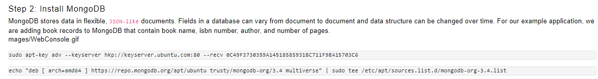

# **MEAN STACK DEPLOYMENT TO UBUNTU IN AWS**

## Step 1: Install NodeJs

* **updated ubuntu with the code below**

`sudo apt update` 

* **upgraded ubuntu with the code below**

`sudo apt upgrade`

* **added certicates with the code below**

`sudo apt -y install curl dirmngr apt-transport-https lsb-release ca-certificates`

`curl -sL https://deb.nodesource.com/setup_12.x | sudo -E bash -`

* **installed node.js with the code below**

`sudo apt install -y nodejs`

## Step 2: Install MongoDB

* **installed mongodb with the code below**

 

* **started and verify the server is running with the codes belwo**

`sudo service mongodb start`

`sudo systemctl status mongodb`

* **Installed npm – Node package manager with the code below**

`sudo apt install -y npm`

* I**nstalled body-parser package with the code below**

`sudo npm install body-parser`

* **followed the step below**

* **Add a file to it named server.js**

* **continuatiom**

* **continuation**

## FINALLY  I CREATED A **INDEX.HTML FILE**  INPUTTED THE REQUIRE CODE IN IT, WENT BACK TO THE **BOOKS DIRECTORY** THEN STARTED THE SERVER BY RUNNING THE CODE `node server.js` 

