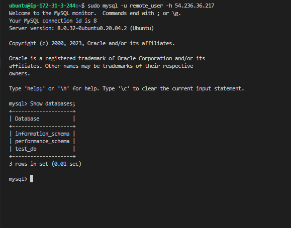

# **IMPLEMENT A CLIENT SERVER ARCHITECTURE USING MYSQL DATABASE MANAGEMENT SYSTEM (DBMS).**

1. **Create and configure two Linux-based virtual servers (EC2 instances in AWS).**
2. **On mysql server Linux Server install MySQL Server software.**

3. **On mysql client Linux Server install MySQL Client software.**

4. **created a new entry in ‘Inbound rules’ in ‘mysql server’ Security Groups. For extra security, did not allow all IP addresses to reach your ‘mysql server’ – allowed access only to my client server ip address only**

## created mysql db on my database server 

5. **configured MySQL server to allow connections from remote hosts.**

i did that with the code below

`sudo vi /etc/mysql/mysql.conf.d/mysqld.cnf`

Replace ‘127.0.0.1’ to ‘0.0.0.0’ like this:

## finally i connected to my mysql database on my client server 

