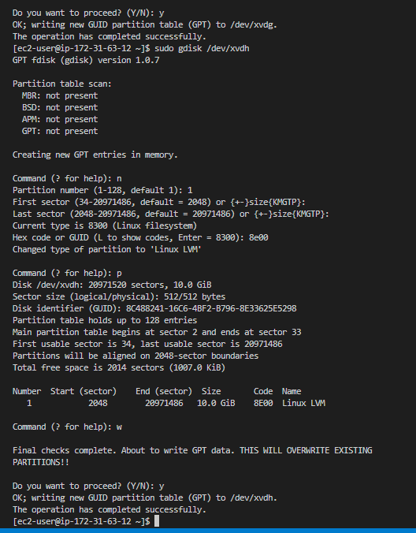
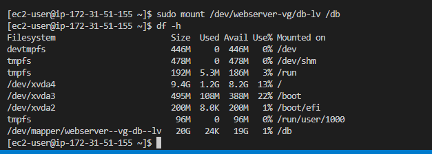

# **WEB SOLUTION WITH WORDPRESS**

## **i created two instances and  six volumes with a space of 10G each attaching three volumes to each instance**
 
* **used lsblk command to view the attached volume**

* **created partions**

* **installed lvm2 using the code below**

`sudo yum install lvm2`

* **created physical volumes with pvcreate**

**verified my created physical volumes with `sudo pvs`**

             i performed the steps above on both instances

## **on my client server i created volume group with vgcreate with the code below**

`sudo vgcreate webdata-vg /dev/xvdh1 /dev/xvdg1 /dev/xvdf1`

**verified my volume groups**

**created a logical volume with the code below**

`sudo lvcreate -n apps-lv -L 14G webdata-vg`

`sudo lvcreate -n logs-lv -L 14G webdata-vg`

 
**verified my logical volumes**

**Verify the entire setup**

**Use mkfs.ext4 to format the logical volumes with ext4 filesystem**

i used the code below to format my logical volumes

`sudo mkfs -t ext4 /dev/webdata-vg/apps-lv`

`sudo mkfs -t ext4 /dev/webdata-vg/logs-lv`

**followed the following steps**

**Updated /etc/fstab file so that the mount configuration will persist after restart of the server**

**Test the configuration and reload the daemon with the code below**

`sudo mount -a`

`sudo systemctl daemon-reload`

**verified with dh -h**

## **on my Database server i created volume group, logical volume, formatted my logical volume and then mount it on /db directory i created**

**also updated my fstab on my database server**

**verified with dh -h**

**updated both intsances repository with the code below**

`sudo yum -y update`

**followed the steps below**

**continuation**

**continuation!!**

## **finally i used my browser to view my result**

