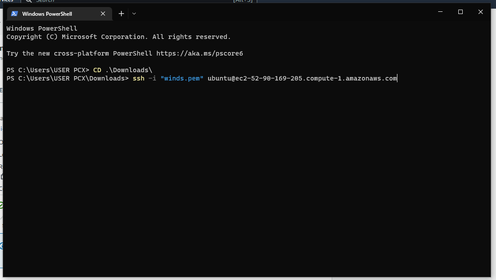

# **HOW TO SET UP YOUR WORKSPACE FOR LEARNING ON YOUR COMPUTER**

### so to set up your workspace you need to 

1. install windows terminal
2. install vs code & vs code extentions
3. install git
4. install openssh server
5. create an instance in aws 

       ## DOWNLOAD AND INSTALL WINDOWS TERMINAL USING THE LINK 

 [WINDOWS TERMINAL DOWNLOAD LINK](https://aka.ms/terminal)
          
          
        ## download and install visual studio code  using the link below

[VISUAL STUDIO CODE DOWNLOAD LINK](https://code.visualstudio.com/Download)

       ## Download and install git using the link below

[GIT  DOWNLOAD LINK](https://git-scm.com/download/win)

 ## After downloading and installing all this above we move to installing openssh server

 ## TO install OPENSSH server you need to open your windows terminal as an adminstrator
 ### You do that by right-clicking on your windows terminal icon with your mouse click on "run as administrator"
          

you have something like this opened

### After that click on the link below 
[OPENSSH SERVER LINK](https://learn.microsoft.com/en-us/windows-server/administration/openssh/openssh_install_firstuse?tabs=powershell#tabpanel_1_powershell)

## follow the instruction on the website on how to install openssh server 

NOTE: you stop where the image above ends on the website

# next thing we need to do is creating ssh-key
**FOLLOW THE LINK BELOW FOR INSTRUCTION ON HOW TO HOST KEY PAIRS WHICH IS YOUR PUBLIC KEY AND PRIVATE KEY**
  
  
  [SSH-KEY LINK](https://learn.microsoft.com/en-us/windows-server/administration/openssh/openssh_keymanagement#host-key-generation)

  

  **Now you have a public/private ed25519 key pair in the location specified. in a /.ssh folder/ , The .pub files are public keys, and files without an extension are private keys:**

 
 # **NOW WE HAVE TO CREATE AN AWS ACCOUNT WHICH WILL SERVE AS OUR CLOUD VIRTUAL MACHINE USING THE LINK BELOW**

 [AWS FREE TIER](https://portal.aws.amazon.com/gp/aws/developer/registration/index.html?refid=c8cfd484-6109-4ced-8253-4b94c5c2f92f)

 * AFTER CREATING YOUR ACCOUNT LETS MOVE ON TO CREATING AN INSTANCE ON OUR AWS CONSOLE 

 1. **locate ec2 dashboard on your asw console**
 

 2. **click on launch instance....then your page should look like the image below**
 
  

  * ## **Give your instance any name of your choice** 
  * ## **For application and os image click on the ubuntu image or icon and pick the ubuntu server 20.04 LST**
  

  * ## **select instance type and create a key-pair login**
  

 ## click on create new pair keys

  
 ## download the .pem file after creating your key-pair

 
 
* ## leave your network and storage setting at its default and then click on **launch instance**

AFTER CREATING YOUR INSTANCE SUCCESSFULLY LOCATE THE INSTANCES PAGE ON YOUE EC2 AWS CONSOLE AND TICK THE CREATED INSTANCE

* CLICK ON  CONNECT 

THEN WE HAVE THIS 

* ## COPY YOUR .PEM LINK

* ## ON YOUR TERMINAL PASTE THE .PEM LINK ON THE DIRECTORY WHERE YOUR KEY-PAIRS FILE WAS DOWNLOADED 

* ## press enter on your keyboard. it will ask you "Are you sure you want to continue connecting (yes/no/[fingerprint])?" type yes and press enter.

**NOW OUR UBUNTU IS SUCCESSFULLY SET UP**

# **NEXT WE HAVE TO CREATE A GITHUB AACOUNT AND THEN LINK IT WITH OUR VISUAL STUDIO CODE**

USING THIS LINK > [GITHUB](https://github.com/signup?ref_cta=Sign+up&ref_loc=header+logged+out&ref_page=%2F&source=header-home)

After creating an account,  create a repository on git hub follow the image example below and click create repository

  

## locate the repository url link by clicking on code and copy the url link 

## Go back to your visual studio code and click on ctrl+shift+p to open the git:clone search box

**paste your github repository url link in the box and then click clone from url**

* # after clicking on the clone from url, visual studio code would ask you to select a destination directory...... create a folder with the name of your git-repository and then select 

# so to create and edit a github file we have to create a mackdown down file (this is where we document our codes)....we can do that by adding .m at endof the file name

## after that we learn how to use our markdown synthax in writing a code on our .md file 

# AFTER WRITING OUR CODE WE COMMIT AND PUSH TO GITHUB BY GOING TO OUR VISUAL STUDIO CODE SOURCE CONTROLL  

 
 ## add a commit message and click commit

 

 

 ## after that refresh your github page on the web browser to see if your documents were uploaded 

 

 